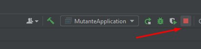

# api-mutante

Existe três profiles nesse projeto:
1. aplication.properties (Mysql em nuvem)
2. aplication-develop.properties (Mysql em Docker)
3. aplication-local.properties (H2)

## 1. aplication-local.properties (H2)

Para executar localmente tem que fazer o seguintes passo:  
### Importar o projeto no **_Intellij_**

Clicar em inicar: 

Apertar stop  
  

Editar Configurações  

Ir e clicar em Modify

  
Add VM Options  

Acrescentar o seguinte comando conforme o print: -DSpring.profiles.active=local   
Obs: Para exeuctar em develop é só trocar o comando para -DSpring.profiles.active=develop.   
Caso queira executar apontando para o banco em nuvem deixar o campo sem o comando.

## 2. aplication-develop.properties (Mysql em Docker)

## 3. aplication.properties (Mysql em nuvem)

  
# Testes unitários:  
Cobertura em Service, Controller e Repository.  
  

Jacoco, cobertura: 
  
  
    
# Colletion   
    

## CURL para profiles default, develop e local
### is Mutant
`curl --location --request POST 'http://localhost:8080/mutant' \  
--header 'Content-Type: application/json' \  
--data-raw '{
"dna":["CTGATA", "CTATGC", "TATTGT", "AGATGG", "CTCCTA", "TCACTG"]
}'`
### is Not Mutant
`curl --location --request POST 'http://localhost:8080/mutant' \
--header 'Content-Type: application/json' \
--data-raw '{
"dna":["CTGATA", "CTATGC", "TATTGT", "AGATGG", "CTCCTA", "TCACTG"]
}'`
### Status
`curl --location --request GET 'http://localhost:8080/stats'`
