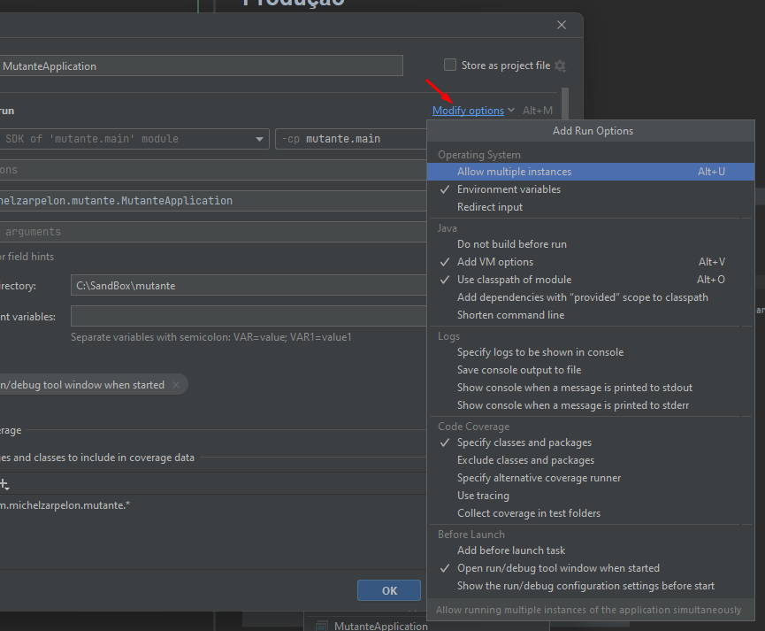
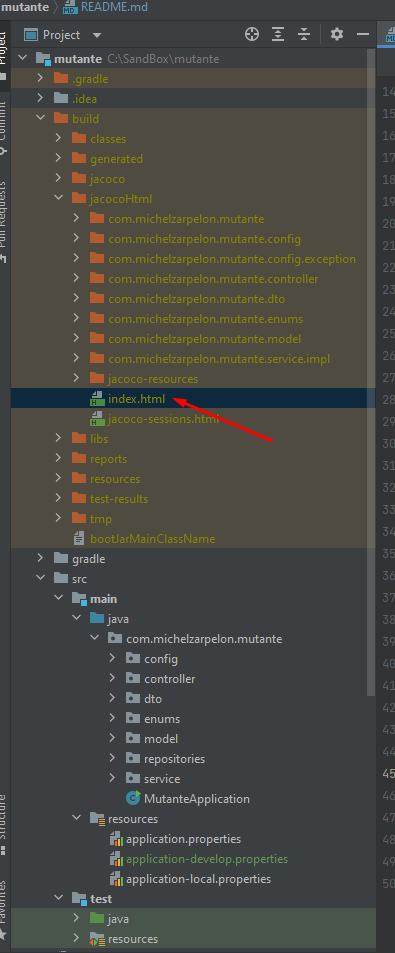

# api-mutante

Existe dois profiles nesse projeto:
1. aplication.properties (Mysql em nuvem)
2. aplication-develop.properties (Mysql em Docker)

## 1. aplication-local.properties (Mysql Docker)

Para executar localmente tem que fazer o seguintes passo:  
### Importar o projeto no **_Intellij_** e ter **DOCKER** instalado

Clicar em inicar: 

Apertar stop  
  

Editar Configurações  

Ir e clicar em Modify

  
Add VM Options  

Acrescentar o seguinte comando conforme o print: -DSpring.profiles.active=develop
Caso queira executar apontando para o banco em nuvem deixar o campo sem o comando.

## 2. aplication.properties (Mysql em nuvem)
Retirar o comando -DSpring.profiles.active=develop ou -DSpring.profiles.active=local

  
# Testes unitários:  
Cobertura em Service, Controller e Repository.  
  

Jacoco, cobertura: 
  
  
    
# Colletion   
    

## CURL para profiles default e develop
### is Mutant
`curl --location --request POST 'http://localhost:8080/mutant' \  
--header 'Content-Type: application/json' \  
--data-raw '{
"dna":["CTGATA", "CTATGC", "TATTGT", "AGATGG", "CTCCTA", "TCACTG"]
}'`
### is Not Mutant
`curl --location --request POST 'http://localhost:8080/mutant' \
--header 'Content-Type: application/json' \
--data-raw '{
"dna":["CTGATA", "CTATGC", "TATTGT", "AGATGG", "CTCCTA", "TCACTG"]
}'`
### Status
`curl --location --request GET 'http://localhost:8080/stats'`

### OBS: 
1. _Não foi feito deploy em nuvem, conforme informado:_ 
2. As Regras de negócio eu fiz conforme entendimento. Caso eu tenha entendido errado me desculpe. 

Qualquer duvida pode me chamar:  
tel: 49998231684  
email: michelzarpe@gmail.com  
linkedin: https://www.linkedin.com/in/michel-zarpelon-38a8a5152/
